# Onigiri
A React Native / Expo app for cross-platform manga reading

[View the Expo app](https://expo.dev/@hahunavth/onigiri?release-channel=production)

[Web demo (incomplete)](https://hahunavth-comic.vercel.app/native)

## Questions?
Feel free to create new issue: https://github.com/hahunavth/comic-net-native/issues

## Preview

  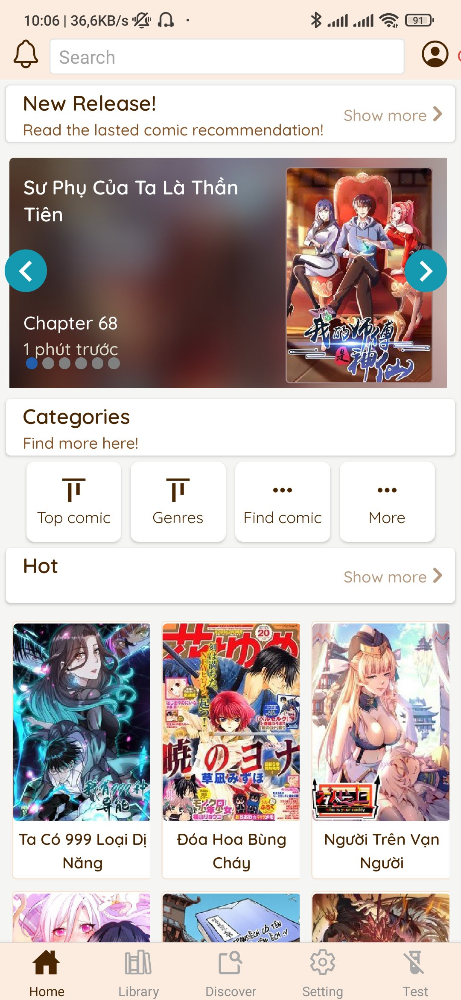
  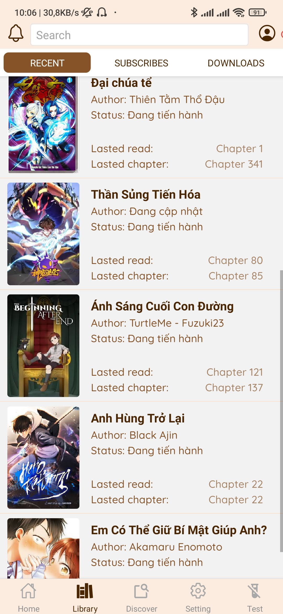 
  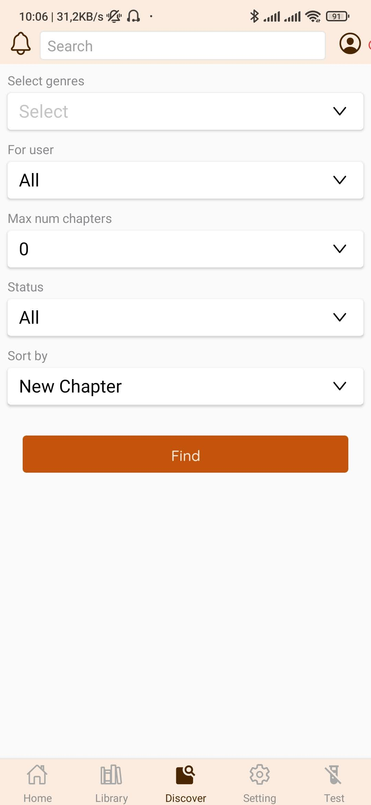
  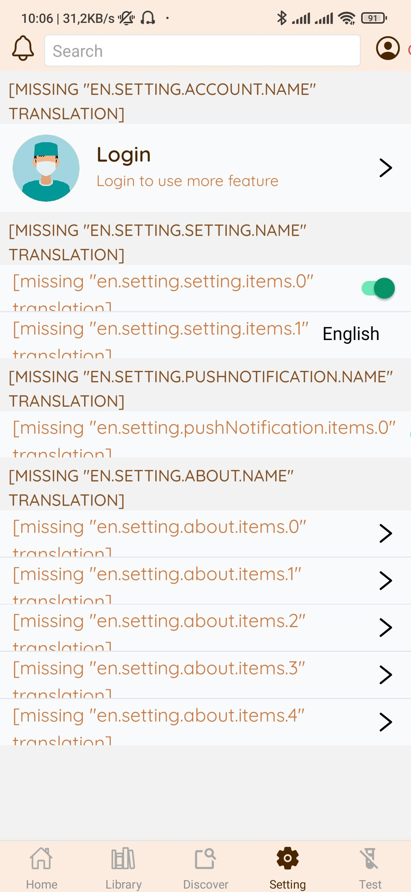
  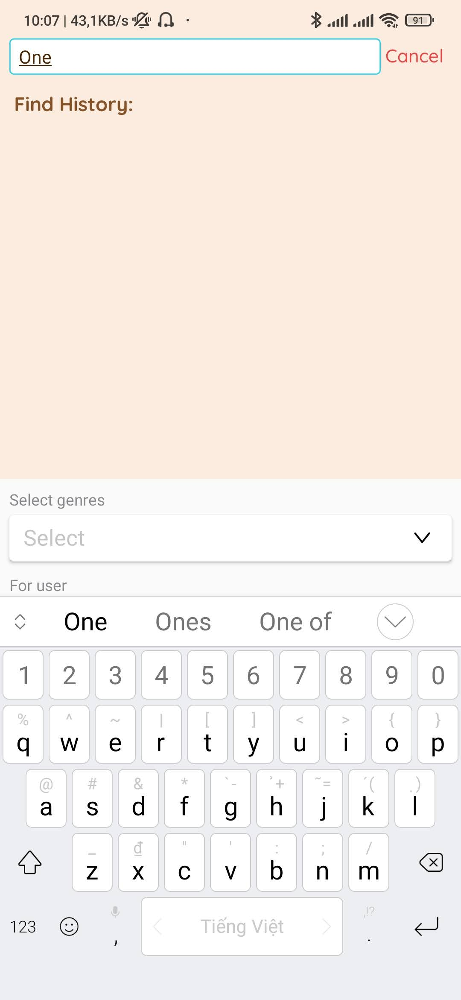
  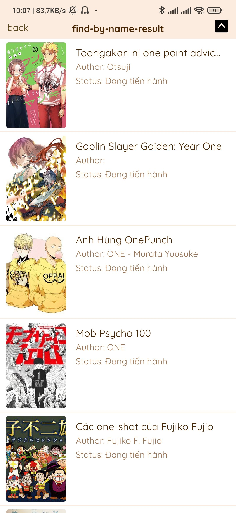
  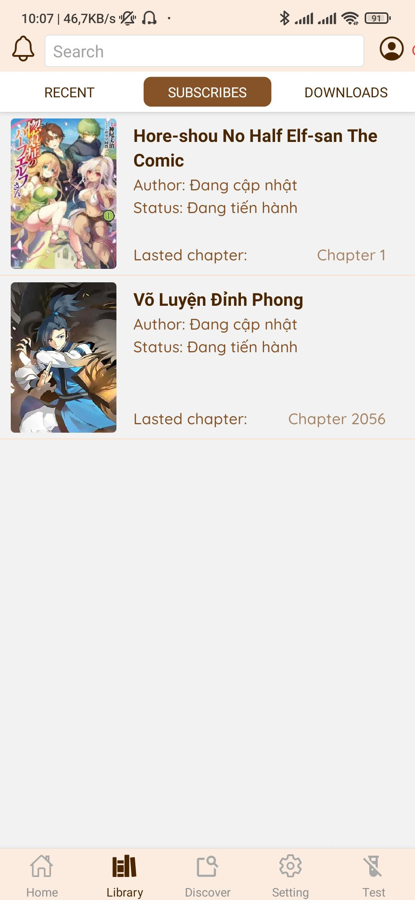
  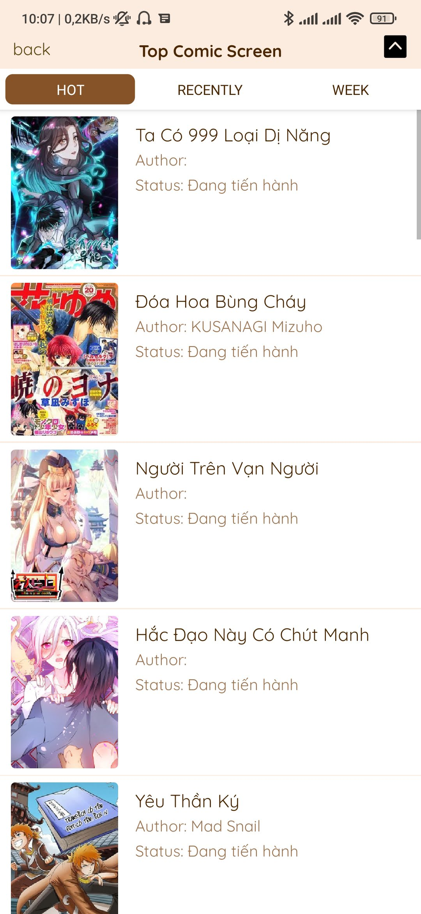
  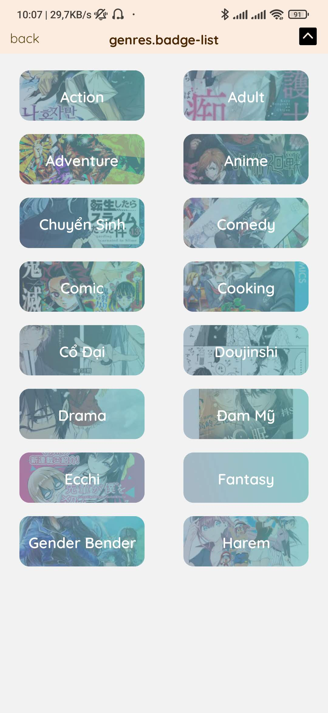
  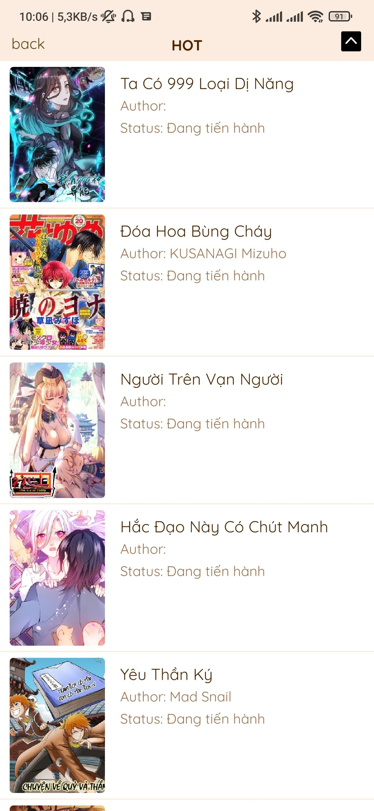
  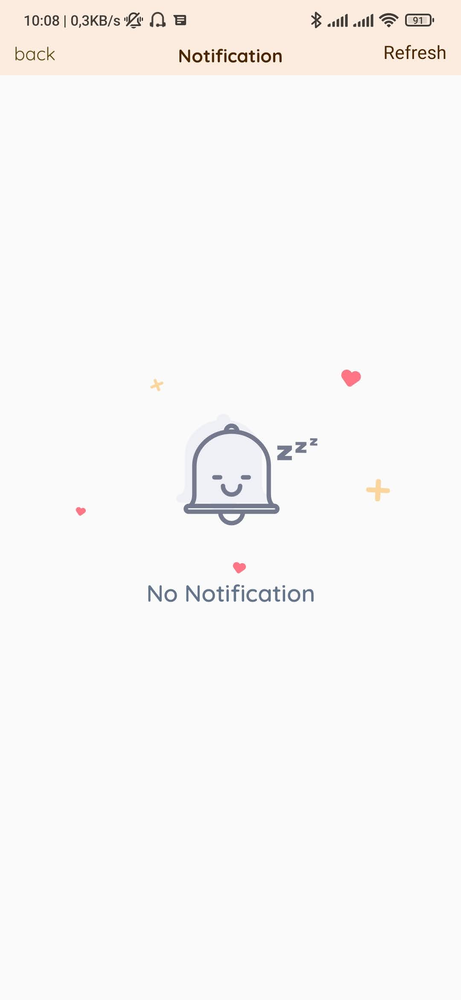
  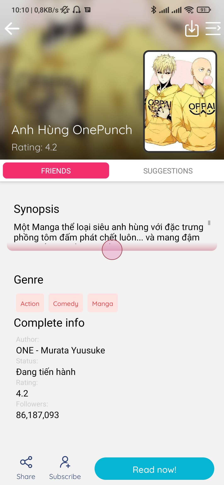
  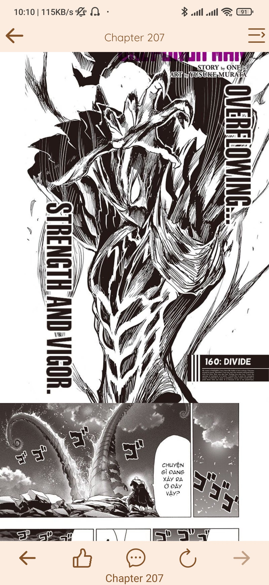
  

## Check list
- [x] EAS Build
- [x] Setup CI 
- [x] Home page
- [x] List comic
- [x] Comic details
- [x] Chapter image
- [x] Find comic
- [ ] ~~Blur bottom bar~~
- [x] Save chapter
- [x] Setting screen
- [ ] Login
- [x] Subscribe comic
- [ ] Comment (1/2)
- [x] Leech and save on db
- [x] Add Sentry
- [x] Background fetch notification
- [ ] Rotate responsive
- [x] I18n
- [ ] Dark theme
- [ ] nextjs
- [ ] Admob (Need config for ios)
